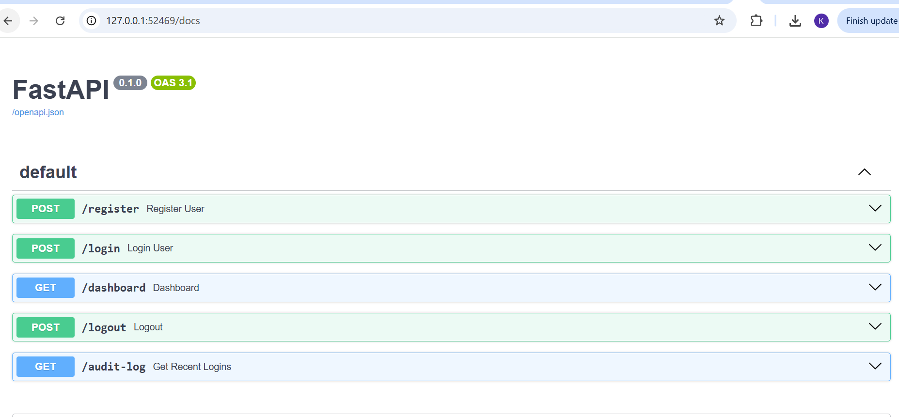
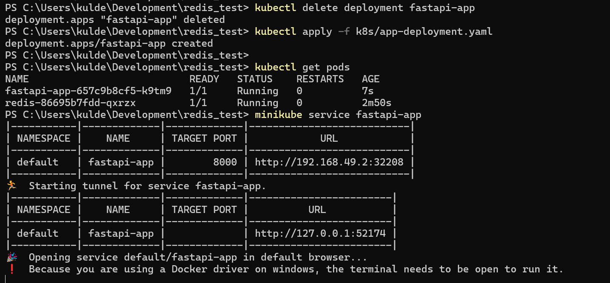
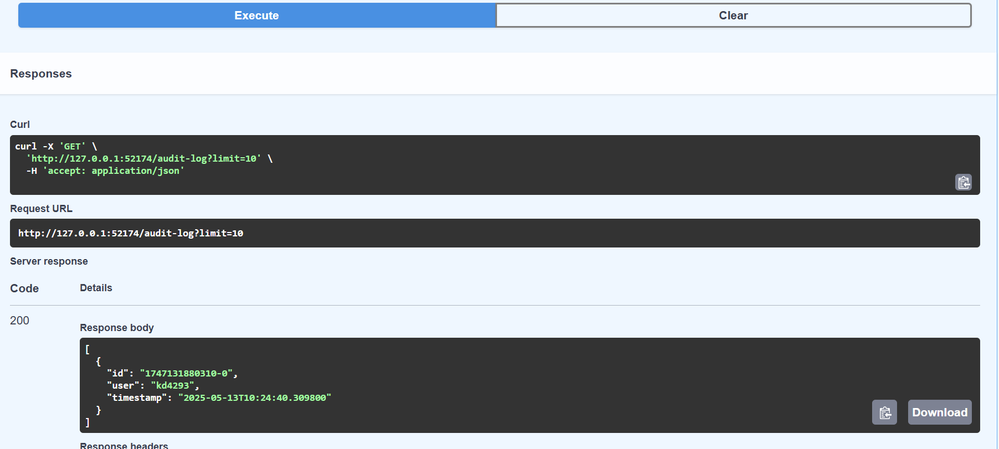

✅ Project Summary
## Redis Login App – FastAPI + Redis + Kubernetes

A simple login system using FastAPI with Redis as the primary store for user data, session management, and audit logging. Deployed inside a Kubernetes cluster (Minikube), the app demonstrates real-world Redis use cases beyond caching.

✅ Features Demoed
- User registration and login using Redis Hashes
- Session token creation and TTL with `SETEX`
- Rate limiting using `INCR` + `EXPIRE`
- Real-time login notifications via Redis Pub/Sub
- Audit log using Redis Streams (`XADD`, `XREVRANGE`)
- Redis data persistence via Kubernetes PVC

✅ How to Run (Minikube Version)
### Prerequisites
- Docker
- Minikube
- kubectl
- Python 3.10+ (for dev-only)

### Build & Deploy

1. Start Minikube
```bash
minikube start
& minikube -p minikube docker-env | Invoke-Expression
```

2. Build the Docker image inside Minikube:
```bash
docker build -t fastapi-app:latest .
```

3. Deploy all components:
```bash
kubectl apply -f k8s/
```

4. Access the app:
```bash
minikube service fastapi-app
```

#### ✅ Redis CLI (Optional Test)
```bash
redis-cli
SUBSCRIBE login-events      # to watch login pub/sub in action
KEYS *                      # to see sessions, audit logs, etc.
```

## 🖼 Screenshots

### 1. FastAPI Swagger UI


### 2. K8s pods


### 3. Redis CLI (Pub/Sub + Keys)


### 4. Audit Log API Output

